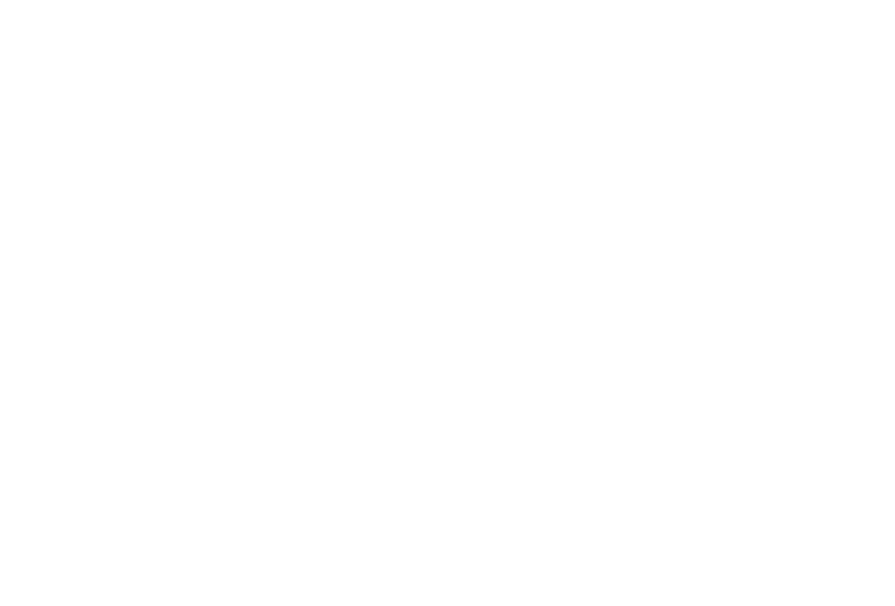
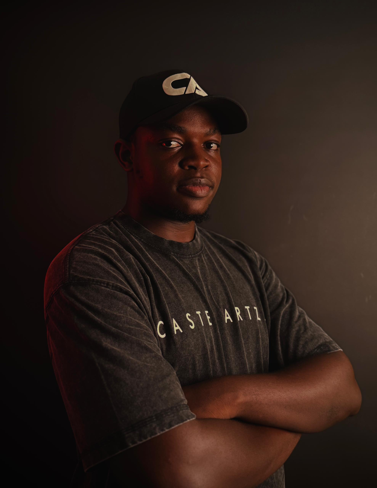

<!DOCTYPE html>
<html lang="en">
<head>
  <meta charset="UTF-8">
  <meta name="viewport" content="width=device-width, initial-scale=1.0">
  <meta name="description" content="Casten Artzz | YouTuber, Web3 Creator and blockchain educationist.">
  <title>Casten Artzz | Web3 Creator</title>

  
</head>

<body>

  <!-- NAVIGATION -->
  <nav class="navbar">
    

      <a href="#home" class="logo">
  
 
  CASTEN ARTZZ
</a>
      <ul class="nav-links">
        <li><a href="#home" class="active">Home</a></li>
        <li><a href="#vision">About</a></li>
        <li><a href="#work">Projects</a></li>
        <li><a href="#featured">Featured</a></li>
        <li><a href="#brands">Brands</a></li>
        <li><a href="#contact">Contact</a></li>
      </ul>

      <a href="#contact" class="nav-button">Work With Me</a>

      <button class="menu-toggle" id="menuToggle" aria-label="Open navigation">☰</button>
    

    

      

        <a href="#home" style="padding:13px 10px;color:var(--muted);font-size:14px">Home</a>
        <a href="#vision" style="padding:13px 10px;color:var(--muted);font-size:14px">About</a>
        <a href="#work" style="padding:13px 10px;color:var(--muted);font-size:14px">Projects</a>
        <a href="#featured" style="padding:13px 10px;color:var(--muted);font-size:14px">Featured</a>
        <a href="#brands" style="padding:13px 10px;color:var(--muted);font-size:14px">Brands</a>
        <a href="#contact" style="padding:13px 10px;color:var(--accent);font-size:14px">Contact</a>
      

    

  </nav>

  <!-- HERO -->
  <section class="hero" id="home">
    

      

        
        
Web3 Creator

      

      

        
YouTuber · Web3 Creator

        <h1 class="reveal">
          I’m Casten Artzz
        </h1>

        <h2 class="reveal">Blockchain educationist and content creator.</h2>

        

          Greetings, fellow crypto explorers.I’m Casten Artzz, a video content creator and UGC creator passionate about creating engaging content that helps brands connect with their audience.
        

        

          <a href="#contact" class="btn btn-primary">Work With Me</a>
          <a href="#work" class="btn btn-secondary">View Projects</a>
        

        

          

            <strong>4+</strong>
            Years in Crypto
          

          

            <strong>25+</strong>
            Projects Consulted
          

          

            <strong>50k+</strong>
            Community Followers
          

          

            <strong>100%</strong>
            Passion for Blockchain
          

        

      

    

  </section>

  <!-- VISION -->
  <section class="section" id="vision">
    

      

        
My Vision in Crypto

        <h2 class="section-title">Making Web3 easier to understand.</h2>
      

      

        

          I believe blockchain technology has the power to transform economies, build financial independence, and open opportunities across the globe.
        

        

          My mission is to help individuals, startups, and enterprises unlock the potential of crypto and decentralized systems.
        

      

    

  </section>

  <!-- EXPERTISE -->
  <section class="section">
    

      

        
What I Do

        <h2 class="section-title">Areas of expertise.</h2>
      

      

        <article class="expertise-item reveal">
          
01

          <h3>Video Content Creation</h3>
          
Creating engaging short form and long form videos for brands, products, and digital platforms.

        </article>

        <article class="expertise-item reveal">
          
02

          <h3>UGC & Brand Content</h3>
          
Creating authentic UGC style content, product videos, testimonials, and social content that connects with audiences.

        </article>

        <article class="expertise-item reveal">
          
03

          <h3>Video Editing & Creative Strategy</h3>
          
Bringing ideas to life through advanced editing, storytelling and creative direction.

        </article>

      

    

  </section>

  <!-- PROJECTS -->
  <section class="section featured" id="work">
    

      

        

          
Selected Projects

          <h2 class="section-title">Work that speaks for itself.</h2>
        

        
Selected work across campaigns, explainers, ecosystem content and creator projects.

      

      

        <article class="work-card reveal">
          

            01
            Campaign
          

          

            <h3>GoDark</h3>
            
Campaign work created around a crypto dark pool DEX.

            <small>Content · Campaign</small>
          

        </article>

        <article class="work-card reveal">
          

            02
            Protocol
          

          

            <h3>mETH Protocol</h3>
            
Educational content focused on liquid staking and helping new users understand the product.

            <small>Education · Web3</small>
          

        </article>

        <article class="work-card reveal">
          

            03
            Cross Chain
          

          

            <h3>Circle CCTP × Injective</h3>
            
Content explaining USDC cross chain transfers through the CCTP ecosystem.

            <small>Explainer · Web3</small>
          

        </article>

        <article class="work-card reveal">
          

            04
            Hackathon
          

          

            <h3>Mantle Turing Test</h3>
            
Hackathon recap content featuring a builder from Unfold.

            <small>Event · Content</small>
          

        </article>

        <article class="work-card reveal">
          

            05
            Social
          

          

            <h3>KnockKnock</h3>
            
Social content created around a wine themed Instagram post for a random video chat app.

            <small>Social · Campaign</small>
          

        </article>

        <article class="work-card reveal">
          

            06
            YouTube
          

          

            <h3>Maple Finance</h3>
            
YouTube content and treasury breakdowns built around verified dashboard figures.

            <small>Long Form · Education</small>
          

        </article>

      

    

  </section>

  <!-- FEATURED ON -->
  <section class="section" id="featured">
    

      

        
Featured On

        <h2 class="section-title">Brands and platforms.</h2>
      

      

        

          
        

        

          
        

        

          
        

        

          
        

        

          
        

      

    

  </section>

  <!-- BRANDS -->
  <section class="section brands-section" id="brands">
    

      

        
Brands

        <h2>Brands I've worked with.</h2>
        
The names below are taken directly from the supplied portfolio information.

      

      

        
Maple Finance

        
GoDark

        
Espresso Network

        
TRON

        
Xborg Games

        
Mintlify

        
mETH Protocol

        
KnockKnock

      

    

  </section>

  <!-- TESTIMONIALS -->
  <section class="section">
    

      

        
Testimonials

        <h2 class="section-title">What people say.</h2>
      

      

        <article class="testimonial reveal">
          

            “Casten Artzz’s educational insights on DeFi educated me on how to start my journey in Web3 and which niche I should follow.”
          

          <strong>Blockchain Startup</strong>
        </article>

        <article class="testimonial reveal">
          

            “He is a thoughtful leader in Web3 and always brings innovative ideas to the table.”
          

          <strong>Crypto Analyst</strong>
        </article>

      

    

  </section>

  <!-- CTA -->
  <section class="cta" id="contact">
    

      
Let's Connect

      <h2 style="margin-top:13px">
        Ready to explore 
        Crypto with me?
      </h2>

      

        Join my community and let’s build the future of finance together.
      

      <a href="contact.html" class="btn btn-primary">Get Started</a>
    

  </section>

  <!-- FOOTER -->
  <footer>
    

      
© 2026 Castenartzz. All Rights Reserved.

      
Web3 Creator · Blockchain Education · Content

    

  </footer>

  

</body>
</html>
